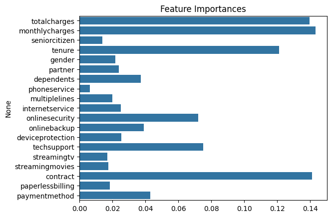

# Previsão de Cancelamento de Clientes (Churn)

## Visão Geral do Projeto

A retenção de clientes é um dos maiores desafios enfrentados por empresas de serviços recorrentes, como as de telecomunicações. Este projeto tem como foco a **identificação dos fatores que contribuem para o cancelamento de clientes (churn)** e o desenvolvimento de um modelo preditivo eficaz com base em dados reais.

**Objetivo**: Antecipar o risco de churn e fornecer subsídios analíticos para estratégias de fidelização.

**Resultado-chave**:  
> Modelos preditivos construídos com alta capacidade de generalização e insights estratégicos sobre comportamento dos clientes.

## Ferramentas e Tecnologias

- **Python 3.11.4**: Linguagem principal para análise e modelagem
- **Pandas & NumPy**: Manipulação de dados
- **Matplotlib & Seaborn**: Visualização de dados
- **Scikit-learn**: Modelos de machine learning e métricas
- **SMOTE (imblearn)**: Balanceamento de classes
- **Pickle**: Serialização de modelo
- **Jupyter Notebook**: Documentação e execução interativa

## Dataset

**Fonte**: Base de dados pública da Telco (empresa de telecom fictícia)  
**Principais colunas**:
- `customerID`: Identificador único do cliente
- `gender`, `SeniorCitizen`, `Partner`, `Dependents`: Informações demográficas
- `tenure`, `MonthlyCharges`, `TotalCharges`: Dados financeiros e de permanência
- `InternetService`, `Contract`, `PaymentMethod`: Serviços contratados
- `Churn`: Variável alvo (cliente cancelou ou não)

## Exploração e Pré-processamento

- Conversão e normalização de tipos de dados (`TotalCharges`)
- Remoção de valores nulos e limpeza da base
- Análise estatística descritiva (tendência central, dispersão, assimetria e curtose)
- Separação entre variáveis numéricas e categóricas
- Estudo da proporção de churn: **base desbalanceada**

## Hipóteses Formuladas

- Clientes com serviço de Internet têm menos probabilidade de abandonar o serviço, já que a Internet geralmente é um serviço essencial.

- Idosos têm maior propensão ao churn por dificuldades tecnológicas ou orçamento restrito

- Clientes que não têm serviços adicionais como o Suporte Técnico têm mais probabilidade de sair porque podem achar que o serviço é incompleto ou que não estão recebendo valor suficiente.

- Clientes que pagam via cartão de crédito ou transferência bancária têm menos probabilidade de abandono devido a pagamentos mais consistentes e automatizados.

- Clientes com cobranças mensais mais altas têm maior probabilidade de cancelar devido à percepção de preços excessivos ou encargos financeiros.

## Engenharia de Atributos

- **Label Encoding** para variáveis categóricas
- **MinMaxScaler** para normalização de variáveis contínuas
- Testes de significância (Chi-Square) para seleção de atributos
- Verificação de correlação entre atributos numéricos

## Balanceamento de Classes

Aplicação do **SMOTE (Synthetic Minority Over-sampling Technique)** para equalizar a proporção entre classes (`Churn = Yes` e `No`), garantindo aprendizado mais equilibrado pelos modelos.

## Modelagem Preditiva

### Modelos Utilizados:
- **Random Forest**
- **Logistic Regression**

### Etapas:
- Split do dataset em treino e teste
- Treinamento com foco em acurácia e interpretabilidade
- Avaliação por **acurácia** e **matriz de confusão**

## Resultados

- Random Forest apresentou melhor desempenho em termos de **precisão e robustez**
- Regressão logística foi útil para **interpretação de coeficientes**
- Identificação dos principais **drivers de churn**:
  - Tipo de contrato
  - Serviços adicionais (segurança online, suporte técnico)
  - Valor mensal cobrado

## Competências Demonstradas

- **Análise Estatística e EDA**: Profundidade na análise de variáveis
- **Feature Engineering**: Transformações e seleções estratégicas
- **Modelagem Preditiva Supervisionada**: Random Forest e Regressão Logística
- **Balanceamento e Preparo de Dados**: Técnicas como SMOTE e encoding
- **Tomada de Decisão baseada em Dados**
- **Clareza na Documentação e Apresentação Visual**
